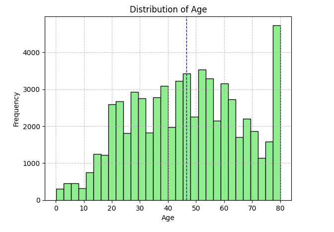
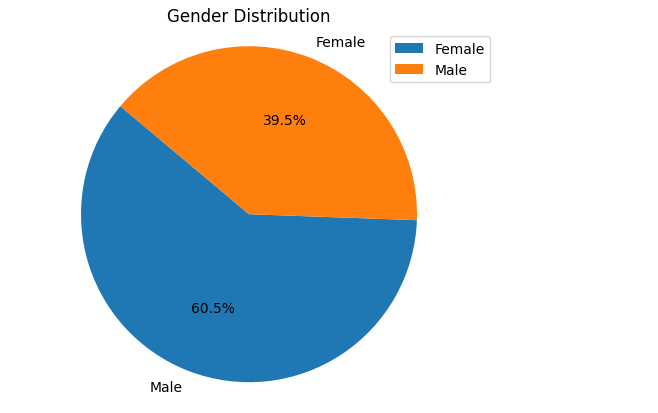
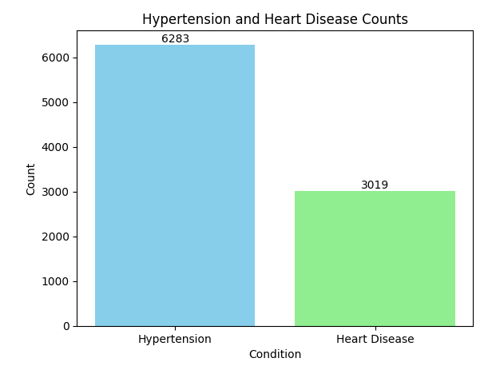
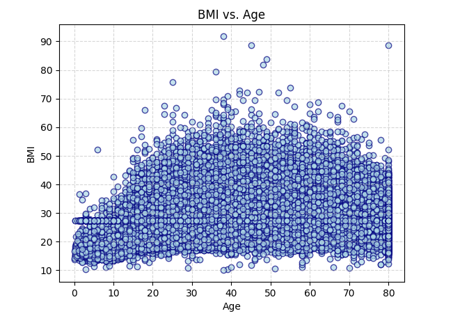
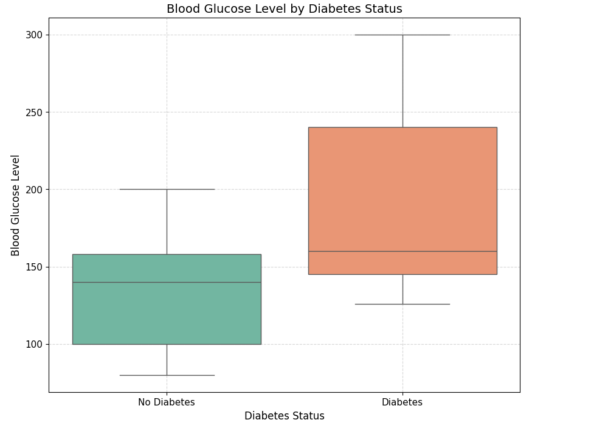
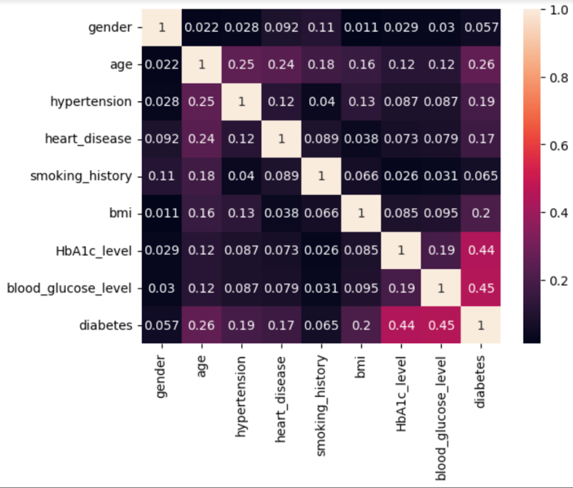

# Project-4: Diabetes Prediction using ML Model

## Collaborators
- Beauty Simora
- Luis Rivera
- Nidhi Ojha
- Preeti Wadhwa
- Steven Miller

## Objective
- In this project, the objective is to predict a probability of being diabetic or non-diabetic based on various features like blood glucose levels, HBA1C levels, BMI etc. This project uses a diabetes prediction dataset from Kaggle. The code is divided into 9 parts that start from data gathering to model deployment to testing the prediction hypothesis with test data via a frontend web page.
- The dataset used in the project takes several diagnostic factors into consideration. These factors include: 
    - Gender
    - Blood Glucose Levels
    - Hypertension
    - Heart Disease
    - Smoking History
    - Body Mass Index (BMI)
    - HBA1C Level 
    - Age
- This model can be useful for healthcare professionals in identifying patients who may be at risk of developing diabetes and in developing personalized treatment plans. 

## Motivation
- Diabetes is an increasingly growing health issue due to our inactive lifestyle. 
- If detected in time then through proper medical treatment, adverse effects can be prevented. 
- To help in early detection, technology can be used very reliably and efficiently. 
- Using machine learning we have built a predictive model that can predict whether the patient is diabetes positive or not.

## What is Diabetes?
- Diabetes is a persistent health condition characterized by impacting the body's ability to convert food into energy. 
- The body breaks down most of the food one consumes into glucose (sugar). The glucose is released into the bloodstream to provide a constant supply of energy to various tissues and organs. - Insulin acts as a ‘key’ that allows sugar into one’s body’s cells for the use of energy. 
- Theory suggests the diabetic condition is caused by an autoimmune response (body attacking self) inhibiting the production of insulin. 
- In other words, because insulin production has been negatively affected, the body will struggle to turn glucose into energy.
- As of today, 38 million people have the condition and around 20% of Americans don't know they have it. 
- The problem is also a growing one as diabetes patients have doubled over the last 20 years and has become the 8th leading cause of death in the US. 
- It's also the leading cause of kidney failure, lower-limb amputations, and adult blindness. 
- While there is no substitute for diet and exercise as a preventative measure, further refinement of technology including but certainly not limited to machine learning models, could mean better medical care and better outcomes for patients. 

## Data Set Used
**[Diabetes Prediction Dataset](https://www.kaggle.com/datasets/iammustafatz/diabetes-prediction-dataset)**

### Dataset Explained

- The Diabetes prediction dataset is based on a collection of medical and demographic data from patients.
- Electronic Health Records (EHRs) are the primary source of data for this Diabetes Prediction dataset. 
- For those who are uninitiated, EHRs are digital versions of patient health records that contain information about their medical history, diagnosis, treatment, medications, and outcomes. 
- The data in EHRs is collected and stored by healthcare facilities, such as hospitals and clinics, as part of their routine clinical practice. 
- Using this dataset has a number of advantages. Those advantages include that EHRs contain a large amount of patient data including demographic and clinical information which can be used to develop accurate machine learning models. 
- EHRs also provide a view of a patient's health over time, which can be used to identify patterns and trends in their health status. 
- Because EHRs are widely used in clinical practice, making the Diabetes Prediction dataset relevant to real-world healthcare environments and applications. 

## Instructions to run the code
- Open the [Diabetes_Prediction.ipynp](https://github.com/nidhi0684/Project4-DiabetesPrediction/blob/main/Diabetes_Prediction.ipynb) file from the main git repo
- Click on the open in colab link on the top of the page
- From the Runtime menu option click on Run all cells and locate output of last cell in PART 9
- Click on the URL provided by google colab which looks like this https://\<UUID\>.colab.googleusercontent.com/
- Diabetes Prediction UI will launch, input all the test parameters such as Gender, Age, Hypertension, Smoking History, Hb1Ac level, glucose levels.
- Click on Predict button, this will pop-up a message displaying probability percentage of subject being diabetic or not based on the input parameters provided

## Code Workflow

### Part 1 to Part 3: Initial repository setup, dataset exploration and cleanup

- Install all the dependencies and Run Spark Session
- Run the cleanup code to remove any existing folder for Project-4 and model from /content directory. This will help us clone the project successfully from GitHub without getting any cloning errors.
- Create a spark dataframe after reading the data from the dataset csv
- Explore the dataframe to find more details on it like:
    - Count the number of rows
    - Study the schema
    - Count total number of diabetic and non-diabetic values. (**Note: 1 - Presence of diabetes, 0 - Absence of diabetes**)
    - Count total number of gender types
    - Check for empty values in the gender column
    - Get the summary statistics to describe the dataframe's count, mean, stddev, min and max
- Part 3 is data cleaning and preparation. In this part 
    - Check for null values
    - Get rid of the "Other" value in the *gender* column to limit it to Male and Female values
    - Remove the "No Info" value from the *smoking_history* column as that will not be useful data for our ML model
    - Assign 0 and 1 value in *gender* column where 0 means "Female" and 1 means "Male"
    - Assign numeric values to the *smoking_history* column where "never" = 0, "ever" = 1, "not current" = 2, "current" = 3, "former" = 4

### Part 4: Data Visualization, Data Wrangling and Observations
- Import dependencies required for visualizations
- Convert PySpark Dataframe to Pandas Dataframe
- Represent dataset with different visualization like:
    - Plot Histogram for age distribution

         
    
    - Pie chart for gender distribution

         

    - Bar chart to show hypertension and heart disease counts

        
    - Scatter Plot for BMI vs Age

        

    - Boxplot of Blood Glucose level by Diabetes Status

        

    - Heatmap for feature correlation
       
        
- Based on the above visualizations following observations are made
    - Dataset used for this study has a balance age distribution representing each decade of human age
    - Dataset has a greater number of non-diabetic records than diabetic indicating imbalance nature
    - Dataset has 60% female representation as opposed to 40% male
    - Dataset has good representation of all possible BMI
    - Dataset has sufficient representation of people with Hypertension or Heart Disease
    - Dataset visualization using Boxplot and Correlation Heatmap indicates clearly that high Hb1Ac & Blood Glucose level is fairly correlated with the outcome.

## The ML Model Used - Logistic Regression
### What is logistic regression?
This type of statistical model (also known as logit model) is often used for classification and predictive analytics. Logistic regression estimates the probability of an event occurring, such as voted or didn’t vote, based on a given dataset of independent variables. Since the outcome is a probability, the dependent variable is bounded between 0 and 1. 

### Logistic regression and machine learning
Within machine learning, logistic regression belongs to the family of supervised machine learning models. Logistic regression is commonly used for prediction and classification problems like 

*Disease prediction: In medicine, this analytics approach can be used to predict the likelihood of disease or illness for a given population. Healthcare organizations can set up preventative care for individuals that show higher propensity for specific illnesses.*

This project uses the Disease prediction application using the Binary logistic regression model to predict probability of test subjects getting diabetes based on the feature selection.

### Part 5 to Part 8: Building, Training, Testing, and Saving of the ML model

- Evaluate the correlation analysis and select the feature
- Find the correlation among the input and output variables
- Select the Feature with the help of *VectorAssembler* from PySpark.ml.feature library.
- Next, create final data using the *LogisticRegression* model from PySpark.ml.classification library.
- Split the dataset and build the model. 70% used for training and 30% for testing.
- Evaluate the model predictions using *BinaryClassificationEvaluator* from PySpark.ml.evaluation library.
- **Model efficiency comes out to be 95.84%**
- Save model so that it can be loaded later to test with external dataset and can be utilized to support flask app. (Model will be saved under /content folder of colab.)
- Part 8 is for prediction on New Data with the saved model. Use test data to evaluate the model prediction with some test input values.

### PART 9: Build Flask app to render UI Home page and leverage ML model to predict probability of being Diabetic 
- Import dependencies to run Flask app and host it on publicly accessible colab URL.
- Initialize Flask app
- Render Home page for Diabetes Prediction to take subject parameters as input
- Dynamic API that will take parameters of subject through Web UI and leverage ML Model above to return probability & prediction for being diabetic.
- Added a code to give users a publicly accessible URL to access the UI as Flask app when run gives local IP to access API. Since this is running on Cloud (Google Colab) and not on local notebook, local IP (127.0.0.1) will not be accessible.

## Observations and Future Enhancements
- The development and evaluation of our diabetes prediction model have yielded promising results. Leveraging a combination of demographic and health-related features including gender, age, medical history, lifestyle factors, and various biomarkers such as BMI, HbA1c level, and blood glucose level, our binary classification regression model has demonstrated high efficiency in accurately predicting the probability of individuals having or not having diabetes.

- With an impressive efficiency rate of **95.84%** on data, our model highlights its robustness and reliability in distinguishing between diabetic and non-diabetic individuals. This achievement underscores the potential of machine learning algorithms in healthcare, particularly in the realm of disease prediction and early intervention.

- The implications of such a model extend beyond mere prediction; it can serve as a valuable tool for healthcare practitioners in identifying high-risk individuals, facilitating proactive interventions, and ultimately improving patient outcomes. 
- Additionally, it can aid in resource allocation and healthcare planning by targeting preventive measures towards those most likely to develop diabetes.

## Limitations
- Despite the promising results, it's essential to acknowledge the limitations and challenges inherent in predictive modeling, including data biases, model interpretability, and generalizability to diverse populations. Continued research and refinement of the model, along with rigorous validation across different cohorts, will be crucial for its successful integration into clinical practice.

- **Data Representativeness:** The model's performance heavily relies on the quality and representativeness of the training data. If the dataset is biased or lacks diversity, the model may not generalize well to broader populations, leading to inaccurate predictions for certain demographic groups or individuals with unique characteristics.

- **Feature Selection:** The features used in the model may not capture the full complexity of diabetes risk factors. There could be other relevant variables, such as genetic predisposition, dietary habits, socioeconomic status, or environmental factors, which were not included in the analysis but could significantly influence diabetes outcomes.

- **Model Interpretability:** While the model achieves high accuracy, its interpretability may be limited. Understanding the rationale behind individual predictions can be challenging, which may hinder the model's acceptance and trust among healthcare professionals and patients.

- **Temporal Dynamics:** The model may not account for temporal changes in risk factors or disease progression over time. Factors such as lifestyle modifications, changes in medication, or evolving health conditions could impact an individual's diabetes risk but are not explicitly considered in the model.

- **Uncertainty Estimation:** The model may not provide robust estimates of uncertainty associated with its predictions. Understanding the confidence intervals or uncertainty bounds is essential for informed decision-making, particularly in clinical settings where erroneous predictions could have significant consequences.

- **External Validation:** While the model demonstrates high efficiency on the test dataset, its performance needs to be validated externally using independent datasets from different populations or healthcare settings to ensure its generalizability and reliability across diverse contexts.

Addressing these limitations requires ongoing research, collaboration, and refinement of the model. Incorporating additional data sources, improving feature selection techniques, enhancing model interpretability, and conducting rigorous validation studies are essential steps towards developing a more robust and clinically useful diabetes prediction tool.

## Conclusion
In conclusion, our diabetes prediction model represents a significant step towards personalized medicine and preventive healthcare. By harnessing the power of machine learning and comprehensive health data, we aim to empower both individuals and healthcare providers in the proactive management of diabetes and its associated risks, ultimately contributing to improved health outcomes and quality of life for all.

## Further Applications
A similar model can be built for a variety of diseases like breast cancer, Dementia, etc. in much detail and can be highly reliable once it gets high enough accuracy.

## References
1. [Kaggle](https://www.kaggle.com/)
2. [StackOverflow](https://stackoverflow.com/)
3. [Flask Documentation](https://flask.palletsprojects.com/en/3.0.x/)
4. [geeks for geeks](https://www.geeksforgeeks.org/)

